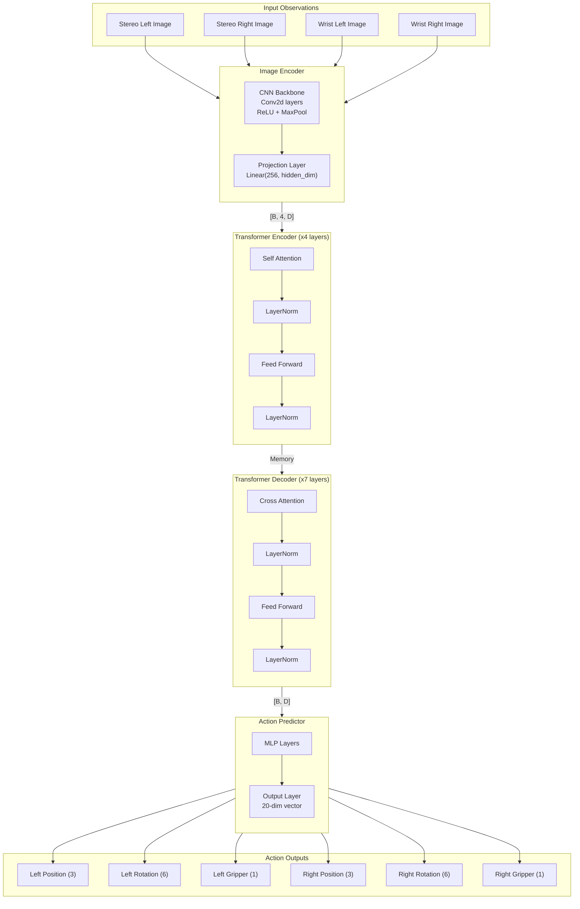

# Surgical Robot Transformer (SRT)

[](https://discord.gg/agora-999382051935506503) [](https://www.youtube.com/@kyegomez3242) [](https://www.linkedin.com/in/kye-g-38759a207/) [](https://x.com/kyegomezb)


An open-source non-official community implementation of the model from the paper: Surgical Robot Transformer (SRT): Imitation Learning for Surgical Tasks: https://surgical-robot-transformer.github.io/


## Installation

```bash
pip3 install srt-torch
```


## Usage

```python

import torch
from loguru import logger
from srt_torch.main import (
    SurgicalRobotTransformer,
    ModelConfig,
    RobotObservation,
)


def run_forward_pass():
    # Initialize model and config
    config = ModelConfig()
    model = SurgicalRobotTransformer(config)
    model.eval()  # Set to evaluation mode

    # Create sample camera images (simulating robot observations)
    # Normally these would come from your robot's cameras
    sample_image = torch.zeros((3, 224, 224))  # [C, H, W] format

    # Create observation object containing all camera views
    observation = RobotObservation(
        stereo_left=sample_image,
        stereo_right=sample_image,
        wrist_left=sample_image,
        wrist_right=sample_image,
    )

    # Perform forward pass
    with torch.no_grad():
        try:
            action = model(observation)

            # Extract predicted actions
            left_pos = action.left_pos.numpy()  # [3] - xyz position
            left_rot = action.left_rot.numpy()  # [6] - 6D rotation
            left_grip = (
                action.left_gripper.numpy()
            )  # [1] - gripper angle

            right_pos = action.right_pos.numpy()  # [3]
            right_rot = action.right_rot.numpy()  # [6]
            right_grip = action.right_gripper.numpy()  # [1]

            logger.info(f"Left arm position: {left_pos}")
            logger.info(f"Left arm rotation: {left_rot}")
            logger.info(f"Left gripper angle: {left_grip}")

            logger.info(f"Right arm position: {right_pos}")
            logger.info(f"Right arm rotation: {right_rot}")
            logger.info(f"Right gripper angle: {right_grip}")

            return action

        except Exception as e:
            logger.error(f"Error during forward pass: {str(e)}")
            raise


if __name__ == "__main__":
    # Set up logging
    logger.add("srt_inference.log")
    logger.info("Starting SRT forward pass example")

    action = run_forward_pass()

    logger.info("Forward pass completed successfully")


```

## Model Architecture



## Training Example
** on progress **

## Datasets

From Section 5 (Experiment Setup), here are the datasets they collected:

1. Tissue Lift Dataset:
- 224 trials
- Single user
- Collected across multiple days
- Task: Grabbing corner of rubber pad and lifting upwards
- Training constraint: Corner kept within marked red box area

2. Needle Pickup and Handover Dataset:
- 250 trials
- Single user
- Collected across multiple days
- Task: Picking up needle and transferring between arms
- Training constraint: Needle placed randomly inside red box area
- Test setup: Center hump of needle placed at nine predefined locations

3. Knot Tying Dataset:
- 500 trials
- Single user
- Collected across multiple days
- Task: Creating loop with left string, grabbing terminal end through loop, pulling grippers apart
- Training constraint: String origins randomly placed inside red box
- Test setup: Strings centered in red box

Additional Test Datasets (Generalization):
1. Pork Tissue Background
- Used for needle pickup and handover task evaluation
- Success rate: 9/9 on pickup, 9/9 on handover

2. Chicken Tissue Background
- Used for qualitative evaluation
- No specific trial numbers mentioned

3. 3D Suture Pad
- Used for qualitative evaluation
- No specific trial numbers mentioned

Important Dataset Collection Details:
- All data collected on da Vinci Research Kit (dVRK)
- Used stereo endoscope and wrist cameras
- Collected in reference configuration shown in Fig. 5
- Used simulated abdomen dome for tool placement
- Approximate placement through larger holes than tool shaft size
- Manual placement using setup joints

The key point about their dataset is from Section 1:
> "...as of 2021, over 10 million surgeries have been performed using 6,500 da Vinci systems in 67 countries, with 55,000 surgeons trained on the system [2]. Often, the video and kinematics data are recorded for post-operative analysis, resulting in a large repository of demonstration data."

However, they did not use this larger dataset, instead collecting their own controlled dataset for the study.

The paper does not mention if they plan to release their datasets publicly.


## Implementation Details from the paper:

```txt
4 Implementation Details
To train our policies, we use action chunking with transformers (ACT) [23] and diffusion policy
[64]. The policies were trained using the endoscope and wrist cameras images as input, which are all
downsized to image size of 224 × 224 × 3. The original input size of the surgical endoscope images
were 1024 × 1280 × 3 and the wrist images were 480 × 640 × 3. Kinematics data is not provided as
input as commonly done in other imitation learning approaches because it is generally inconsistent
due to the design limitations of the dVRK. The policy outputs include the end-effector (delta) position,
(delta) orientation, and jaw angle for both arms. We leave further specific implementation details in
Appendix A.
```

### Appendix A

```txt
main modifications include changing the input layers to accept four images, which include left/right surgical endoscope views and left/right wrist camera views. The output dimensions are also
revised to generate end-effector poses, which amounts to a 10-dim vector for each arm (position [3]+ orientation [6] + jaw angle [1] = 10), thus amounting to a 20-dim vector total for both arms. The
orientation was modeled using a 6D rotation representation following [21], where the 6 elements corrrespond to the first two columns of the rotation matrix. Since the network predictions may not
generate orthonormal vectors, Gram-Schmidt process is performed to convert them to orthonormal vectors, and a cross product of the two vectors are performed to generate the remaining third column
of the rotation matrix. For diffusion policy, similar modifications are made such as changing the input and the output dimensions of the network appropriately. The specific hyperparameters for training
are shown in Table 3 and 4.
```

# Todo

- [ ] Add training logic (in progress)
- [ ] Start testsing
- [ ] Make a list of the datasets used in the paper


## Citation


```bibtex
@misc{kim2024surgicalrobottransformersrt,
    title={Surgical Robot Transformer (SRT): Imitation Learning for Surgical Tasks}, 
    author={Ji Woong Kim and Tony Z. Zhao and Samuel Schmidgall and Anton Deguet and Marin Kobilarov and Chelsea Finn and Axel Krieger},
    year={2024},
    eprint={2407.12998},
    archivePrefix={arXiv},
    primaryClass={cs.RO},
    url={https://arxiv.org/abs/2407.12998}, 
}
```